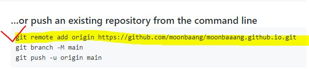

# 원격저장소 기초 활용

* Github에 비어있는 저장소(Repository)를 만든다.

</br>

## 기본 명령어

### 원격저장소(Remote Repository) 설정

```bash
$ git remote add origin __url__
#예시
$ git remote add origin https://github.com/moonbaaang/first.git
```

* 위 코드를 사람말로 표현하면?

  * 깃, 원격저장소(remote) 추가해서 (add) 오리진이란 이름으로 (origin) URL을 불러온다.

* first.git 원격저장소를 처음 만들면 아래와 같은 설명 라인을 paste하면 된다. 

  * 아래는 참고사진으로 위의 내용과 동일하진 않다.

  
  
* 설정한 원격저장소를 확인하기 위해서는 아래의 명령어를 활용한다.

```bash
$ git remote -v
origin  https://github.com/moonbaang/first.git (fetch)
origin  https://github.com/moonbaang/first.git (push)
```

</br>

## push

```bash
$ git push origin master
```

* origin 원격저장소로 push한다.