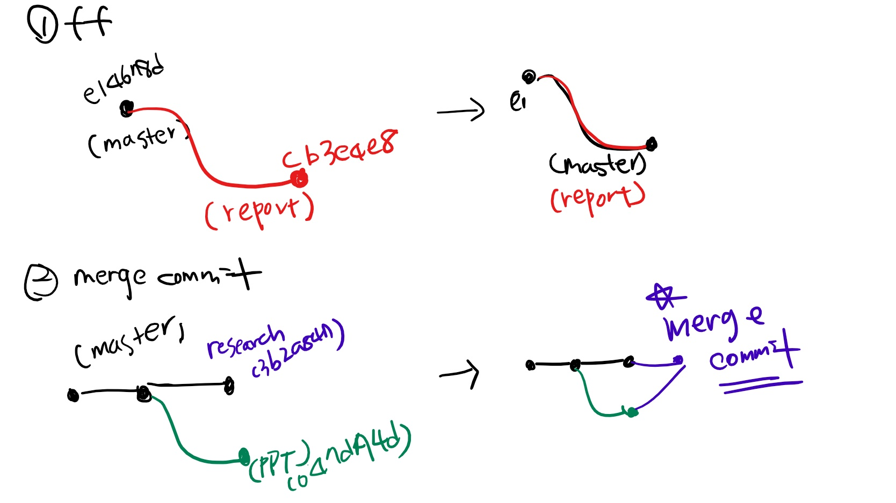
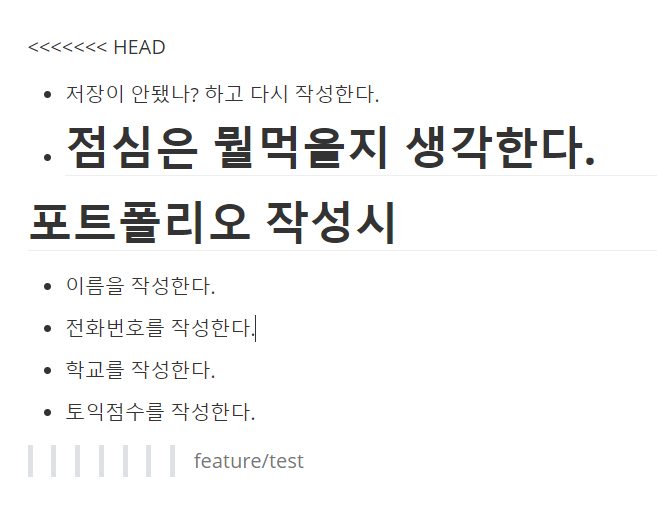
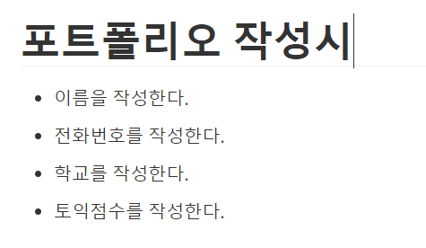

## 준비

> Git 저장소와 루트 커밋 발생

* 조모임 폴더를 만들고
* 비어 있는 README.md 파일을 만들어서
* 커밋!

### 상황 1. fast-foward (프리라이딩)

> fast-foward는 feature 브랜치 생성된 이후 master 브랜치에 변경 사항이 없는 상황

##### 1. feature/report 라는 branch를 생성 및 이동해보자.

```bash
(master) $ git branch feature/report
(master) $ git branch
  feature/report
* master
(master) $ git checkout feature/report
Switched to branch 'feature/report'
(feature/report) $ git branch
* feature/report
  master

```

* checkout 한 결과 현재 branch의 위치가 나타나게 된다.

##### 2 .작업 완료 후 commit을 진행한다.

```bash
$ touch report.txt
$ git add .
$ git commit -m 'Complete report'
[feature/report cb3e4e8] Complete report
 1 file changed, 0 insertions(+), 0 deletions(-)
 create mode 100644 report.txt
```

* feature/report branch 내부에서 report.txt 라는 파일의 작업을 완료하고 commit을 한 모습이다.

```bash
$ git log --oneline
cb3e4e8 (HEAD -> feature/report) Complete report
e14678d (master) Add README.md
```

* 로그를 확인해보면 commit이 완료되어있는 것을 볼 수 있다.

##### master branch로 이동한다.

```bash
$ git checkout master
Switched to branch 'master'
```

##### master branch에 병합시킨다. (merge)

```bash
$ git log --oneline
e14678d (HEAD -> master) Add README.md
# feature/report branch에서 작업한 내용이 CLI화면에 나타나지 않는다.

$ git merge feature/report
Updating a2912cd..9f464fa
Fast-forward
 report.txt | 0
 1 file changed, 0 insertions(+), 0 deletions(-)
 create mode 100644 report.txt
```

##### 결과 -> fast-foward (단순히 HEAD를 이동시켰다.)

```bash
$ git log --oneline
9f464fa (HEAD -> master, feature/report) Complete report
a2912cd README.md
```

##### 작업이 완료된 branch의 삭제방법은 아래와 같다.

```bash
$ git branch -d feature/report
Deleted branch feature/report (was cb3e4e8).
```

---

### 상황 2. merge commit

> 서로 다른 이력(commit)을 병합(merge)하는 과정에서 다른 파일이 수정되어 있는 상황
>
> git이 auto merging을 진행하고, commit이 발생된다.

##### 1. feature/ppt branch를 생성 및 이동시킨다.

```bash
$ git checkout -b feature/ppt
Switched to a new branch 'feature/ppt'
```

* 이번에는 feature/ppt branch에서 새로운 ppt 작업을 진행한다고 가정해본다.

##### 2. 작업 완료 후에 commit한다.

```bash
$ touch ppt.pptx
$ git add .
$ git commit -m 'Complete ppt'
$ git log --oneline
0ff83d1 (HEAD -> feature/ppt) Complete ppt
9f464fa (master) Complete report
a2912cd README.md
```

##### 3. master branch로 이동한다.

```bash
$ git checkout master
```

##### 4. master에 추가 commit을 발생시킨다.

* **다른 파일을 수정 혹은 생성후 진행해보세요.**

```bash
$ touch research.txt
$ git add .
$ git commit -m 'Complete research'
$ git log --oneline
44b1c68 (HEAD -> master) Complete research
9f464fa Complete report
a2912cd README.md
```

##### 5. master에 병합한다.

```bash
$ git merge feature/ppt
Merge made by the 'recursive' strategy.
 ppt.pptx | 0
 1 file changed, 0 insertions(+), 0 deletions(-)
 create mode 100644 ppt.pptx
```

##### 6. 결과 -> 자동으로 merge commit이 발생한다.

* vim 편집기 화면이 나타난다.

* 혹은 다른 편집기를 설정하였다면 자동으로 commit됐다는 화면이 나온다.

  * ex) vs code

  

* 위와같이 vim 편집기 같은 경우 자동으로 작성된 커밋 메시지를 확인하고, `esc`를 누른 후 `:wq`를 입력하여 저장 및 종료한다.

  * `w` : write
  * `q` : quit

* 커밋이  되었는지 확인해본다.

##### 7. 그래프 확인하기

```bash
$ git log --oneline --graph
*   64891e3 (HEAD -> master) Merge branch 'feature/ppt'
|\
| * 0ff83d1 (feature/ppt) Complete ppt
* | 44b1c68 Complete research
|/
* 9f464fa Complete report
* a2912cd README.md
```

##### 8. branch 삭제

```bash
$ git branch -d feature/ppt
Deleted branch feature/ppt (was 0ff83d1).
```



---

### 상황 3. merge commit 충돌

> 서로 다른 이력(commit)을 병합(merge)하는 과정에서 동일 파일이 수정되어 있는 상황
>
> git이 auto merging을 하지 못하고, 해당 파일의 위치에 라벨링을 해준다.
>
> 원하는 형태의 코드로 직접 수정을 하고 merge commit을 발생시켜야 한다.

* 간단히 말하면 동일파일이 존재할 때!

##### 1. feature/test branch를 생성 및 이동한다.

```bash
$ git checkout -b feature/test
Switched to a new branch 'feature/test'
```

##### 2. 작업 완료 후 commit한다.

* 진행 전에 README 파일을 수정시켜둔다!

```bash
# README 수정 후 저장
$ touch test.txt
$ git status
On branch feature/test
Changes not staged for commit:
  (use "git add <file>..." to update what will be committed)
  (use "git restore <file>..." to discard changes in working directory)
        modified:   README.md

Untracked files:
  (use "git add <file>..." to include in what will be committed)
        test.txt

no changes added to commit (use "git add" and/or "git commit -a")
```

```bash
$ git add .
$ git commit -m 'Update README & Complete test'
```

##### 3. master branch로 이동한다.

```bash
$ git checkout master
```

##### 4. master branch에 추가 commit을 발생시킨다.

* **동일 파일을 수정 혹은 생성하세요!**

```bash
# README 파일의 내용을 수정한 상황
$ git add .
$ git status
On branch master
Changes to be committed:
  (use "git restore --staged <file>..." to unstage)
        modified:   README.md
        
$ git commit -m 'Update README'
[master d81da4e] Update README
 1 file changed, 2 insertions(+)

```

##### 5. master에 병합

```bash
$ git merge feature/test
# 자동 merging을 하다가..
Auto-merging README.md
# README.md에서 충돌
CONFLICT (content): Merge conflict in README.md
# 실패; 
Automatic merge failed; fix conflicts and then commit the result.
# 충돌을 고치고, 그 결과를 커밋할 것
(master|MERGING) $
```

##### 6. 결과 -> *merge conflict발생*

```bash
$ git status
On branch master
# 병합이 안된 내용이 있다.
You have unmerged paths.
# 충돌을 고치고 commit하여라.
  (fix conflicts and run "git commit")
  (use "git merge --abort" to abort the merge)

Changes to be committed:
        new file:   test.txt

Unmerged paths:
  (use "git add <file>..." to mark resolution)
  #  README가 동시에 수정됨을 나타내준다.
        both modified:   README.md

```

##### 7. 충돌 확인 및 해결

* README.md 파일을 열어본다.



* 다음과 같이 내용이 충돌된 모습이 나타난다.
* 이때 자신이 원하는 내용만 직접 수정하여 간추려 나타내면 된다.



##### 8. merge commit을 진행한다.

* 수정이 완료됐으면 다음과 같이 수행한다.

```bash
$ git add .
$ git status
On branch master
# 모든 충돌이 고쳐졌다.
# merge를 끝내려면 커밋해
All conflicts fixed but you are still merging.
  (use "git commit" to conclude merge)

Changes to be committed:
        modified:   README.md
        new file:   test.txt

$ git commit
[master bd6c94c] Merge branch 'feature/test'
```

* vim 편집기 화면이 나타난다.

* 자동으로 작성된 커밋 메시지를 확인하고, `esc`를 누른 후 `:wq`를 입력하여 저장 및 종료한다.
  * `w` : write
  * `q` : quit

* 커밋이 잘 되었는지 확인해본다.

##### 9. 그래프 확인하기

```bash
$ git log --oneline --graph
*   6fc8d49 (HEAD -> master) Merge branch 'feature/test'
|\
| * a0aa439 (feature/test) Update README & Complete test
* | d81da4e Update README
|/
*   64891e3 Merge branch 'feature/ppt'
|\
| * 0ff83d1 Complete ppt
* | 44b1c68 Complete research
|/
* 9f464fa Complete report
* a2912cd README.md
```

##### 10. branch 삭제

```bash
$ git branch -d feature/test
```

